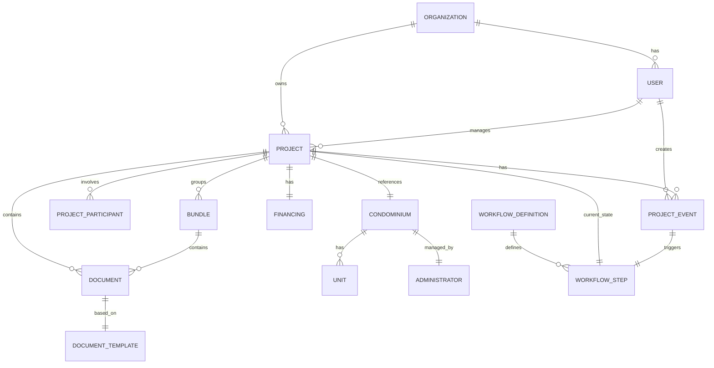

# Backend Architecture Proposal

## Executive Summary

This document proposes a **flexible, event-driven architecture** for transforming the Dashboard Blueprint prototype into a production-grade SaaS platform. The design centers on the `Project` as the core entity, with extensible data structures that can evolve without schema-breaking changes.

---

## Core Design Principles

| Principle | Rationale |
|-----------|-----------|
| **Project-centric** | All data orbits around the Project entity |
| **Workflow-driven** | State machine controls available actions and views |
| **Event-sourced** | Every change is an immutable event for audit trail |
| **Schema flexibility** | JSONB columns for extensible metadata |
| **Multi-tenancy ready** | Organization isolation from day one |

---

## Entity Relationship Diagram



---

## Database Schema

### Core Entities

#### `organizations`
Multi-tenant isolation layer.

| Column | Type | Description |
|--------|------|-------------|
| `id` | UUID | Primary key |
| `name` | VARCHAR(255) | Organization name |
| `slug` | VARCHAR(100) | URL-friendly identifier |
| `settings` | JSONB | Configurable settings |
| `created_at` | TIMESTAMP | |
| `updated_at` | TIMESTAMP | |

---

#### `users`
Platform users with role-based access.

| Column | Type | Description |
|--------|------|-------------|
| `id` | UUID | Primary key |
| `organization_id` | UUID | FK to organizations |
| `email` | VARCHAR(255) | Unique per org |
| `full_name` | VARCHAR(255) | |
| `role` | ENUM | `admin`, `operator`, `viewer` |
| `department` | VARCHAR(100) | Front office, Back office, etc. |
| `avatar_url` | TEXT | |
| `settings` | JSONB | User preferences |
| `created_at` | TIMESTAMP | |

---

#### `projects` ⭐ *Core Entity*
The central entity around which everything revolves.

| Column | Type | Description |
|--------|------|-------------|
| `id` | UUID | Primary key |
| `organization_id` | UUID | FK to organizations |
| `display_id` | VARCHAR(50) | Human-readable ID (e.g., "PRA-2024-001") |
| `name` | VARCHAR(255) | Project name |
| `condominium_id` | UUID | FK to condominiums |
| `financing_id` | UUID | FK to financings |
| `current_step_id` | UUID | FK to workflow_steps |
| `assigned_to` | UUID | FK to users (current owner) |
| `broker_id` | VARCHAR(50) | External broker reference |
| `ocs_id` | VARCHAR(50) | External OCS reference |
| `metadata` | JSONB | Extensible project data |
| `status` | ENUM | `active`, `archived`, `cancelled` |
| `created_at` | TIMESTAMP | |
| `updated_at` | TIMESTAMP | |

> [!TIP]
> The `metadata` JSONB column allows adding new fields without migrations. Example: `{"rating": "positive", "product_code": "FIN-ECO-110"}`

---

#### `project_events` 📜 *Event Sourcing*
Immutable audit trail for every action.

| Column | Type | Description |
|--------|------|-------------|
| `id` | UUID | Primary key |
| `project_id` | UUID | FK to projects |
| `user_id` | UUID | FK to users (who performed action) |
| `event_type` | ENUM | `status_change`, `document_upload`, `note_added`, `assignment_change`, etc. |
| `from_step_id` | UUID | FK to workflow_steps (nullable) |
| `to_step_id` | UUID | FK to workflow_steps (nullable) |
| `payload` | JSONB | Event-specific data |
| `created_at` | TIMESTAMP | Immutable |

> [!IMPORTANT]
> Events are **never** deleted or updated. This provides a complete audit trail for compliance and debugging.

---

### Document Management

#### `document_templates`
Master list of document types.

| Column | Type | Description |
|--------|------|-------------|
| `id` | UUID | Primary key |
| `organization_id` | UUID | FK (nullable for system-wide templates) |
| `code` | VARCHAR(50) | Unique code (e.g., "BROKER_PRIVACY") |
| `name` | VARCHAR(500) | Document name |
| `category` | VARCHAR(100) | BROKER, CEFIN, Condominio, etc. |
| `requires_signature` | BOOLEAN | |
| `is_template` | BOOLEAN | Is this a pre-filled template? |
| `required_in_steps` | UUID[] | Array of workflow_step IDs where required |
| `metadata` | JSONB | Additional configuration |
| `sort_order` | INTEGER | Display ordering |

---

#### `documents`
Actual uploaded/generated documents.

| Column | Type | Description |
|--------|------|-------------|
| `id` | UUID | Primary key |
| `project_id` | UUID | FK to projects |
| `template_id` | UUID | FK to document_templates |
| `bundle_id` | UUID | FK to bundles (nullable) |
| `file_name` | VARCHAR(255) | Original file name |
| `file_path` | TEXT | Storage path (S3, GCS, etc.) |
| `file_size` | BIGINT | Size in bytes |
| `mime_type` | VARCHAR(100) | |
| `status` | ENUM | `pending`, `uploaded`, `validated`, `rejected` |
| `is_signed` | BOOLEAN | |
| `signed_at` | TIMESTAMP | |
| `signed_by` | UUID | FK to users |
| `validated_by` | UUID | FK to users |
| `validated_at` | TIMESTAMP | |
| `rejection_reason` | TEXT | |
| `metadata` | JSONB | Version info, OCR data, etc. |
| `uploaded_by` | UUID | FK to users |
| `created_at` | TIMESTAMP | |
| `updated_at` | TIMESTAMP | |

---

#### `bundles` (Fascicoli)
Logical grouping of documents.

| Column | Type | Description |
|--------|------|-------------|
| `id` | UUID | Primary key |
| `project_id` | UUID | FK to projects |
| `name` | VARCHAR(255) | Bundle name |
| `description` | TEXT | |
| `bundle_type` | ENUM | `broker`, `cefin`, `condominium`, `project`, `custom` |
| `is_complete` | BOOLEAN | All required docs present? |
| `created_at` | TIMESTAMP | |

---

### Condominium & Financing

#### `condominiums`
Condominium master data.

| Column | Type | Description |
|--------|------|-------------|
| `id` | UUID | Primary key |
| `organization_id` | UUID | FK to organizations |
| `fiscal_code` | VARCHAR(20) | Codice Fiscale |
| `vat_number` | VARCHAR(20) | Partita IVA (nullable) |
| `name` | VARCHAR(255) | |
| `type` | ENUM | `standard`, `supercondominio`, `minimal` |
| `constitution_date` | DATE | |
| `unit_count` | INTEGER | |
| `staircase_count` | INTEGER | |
| `address` | JSONB | Structured address |
| `cadastral_data` | JSONB | Dati catastali |
| `insurance` | JSONB | Polizza info |
| `metadata` | JSONB | Extensible |
| `created_at` | TIMESTAMP | |
| `updated_at` | TIMESTAMP | |

---

#### `administrators`
Building administrators.

| Column | Type | Description |
|--------|------|-------------|
| `id` | UUID | Primary key |
| `condominium_id` | UUID | FK to condominiums |
| `user_id` | UUID | FK to users (nullable, if they have platform access) |
| `full_name` | VARCHAR(255) | |
| `studio_name` | VARCHAR(255) | |
| `email` | VARCHAR(255) | |
| `pec` | VARCHAR(255) | |
| `phone` | VARCHAR(50) | |
| `appointment_date` | DATE | |
| `mandate_expiry` | DATE | |
| `is_active` | BOOLEAN | |
| `metadata` | JSONB | |

---

#### `financings`
Financing product details.

| Column | Type | Description |
|--------|------|-------------|
| `id` | UUID | Primary key |
| `project_id` | UUID | FK to projects (1:1) |
| `product_name` | VARCHAR(255) | |
| `product_code` | VARCHAR(50) | |
| `purpose` | VARCHAR(255) | |
| `rate_type` | ENUM | `fixed`, `variable`, `capped` |
| `indexation` | VARCHAR(50) | Euribor 3M, etc. |
| `amortization_type` | ENUM | `french`, `italian`, `bullet` |
| `amounts` | JSONB | requested, approved, ltv, rate, etc. |
| `duration` | JSONB | months, preammortization, etc. |
| `guarantees` | JSONB | MCC, fideiussioni, etc. |
| `fees` | JSONB | istruttoria, incasso, etc. |
| `created_at` | TIMESTAMP | |
| `updated_at` | TIMESTAMP | |

> [!NOTE]
> Using JSONB for `amounts`, `duration`, `guarantees`, and `fees` allows adding new financial parameters without schema changes.

---

### Workflow Engine

#### `workflow_definitions`
Defines the workflow structure.

| Column | Type | Description |
|--------|------|-------------|
| `id` | UUID | Primary key |
| `organization_id` | UUID | FK (nullable for system-wide) |
| `name` | VARCHAR(255) | |
| `description` | TEXT | |
| `version` | INTEGER | |
| `is_active` | BOOLEAN | |
| `created_at` | TIMESTAMP | |

---

#### `workflow_steps`
Individual states in a workflow.

| Column | Type | Description |
|--------|------|-------------|
| `id` | UUID | Primary key |
| `workflow_id` | UUID | FK to workflow_definitions |
| `full_name` | VARCHAR(255) | "Caricata - Lavorazione AML" |
| `state` | VARCHAR(100) | "Caricata" |
| `sub_state` | VARCHAR(100) | "Lavorazione AML" |
| `owner_role` | VARCHAR(100) | "Back office" |
| `sort_order` | INTEGER | |
| `is_start` | BOOLEAN | |
| `is_final` | BOOLEAN | |
| `is_success` | BOOLEAN | |
| `view_config` | JSONB | Available tabs, defaultTab, showAssistant, etc. |
| `assistant_config` | JSONB | Checklist items, warnings, etc. |
| `metadata` | JSONB | |

---

#### `workflow_transitions`
Valid state transitions.

| Column | Type | Description |
|--------|------|-------------|
| `id` | UUID | Primary key |
| `workflow_id` | UUID | FK to workflow_definitions |
| `from_step_id` | UUID | FK to workflow_steps |
| `to_step_id` | UUID | FK to workflow_steps |
| `condition` | JSONB | Optional: rules for auto-transition |
| `action_label` | VARCHAR(100) | "Conferma Verifica" |
| `requires_approval` | BOOLEAN | |

---

### Team & Participants

#### `project_participants`
People involved in a project (not platform users).

| Column | Type | Description |
|--------|------|-------------|
| `id` | UUID | Primary key |
| `project_id` | UUID | FK to projects |
| `role` | ENUM | `administrator`, `president`, `relevant_owner`, `broker`, `internal` |
| `person_name` | VARCHAR(255) | |
| `email` | VARCHAR(255) | |
| `phone` | VARCHAR(50) | |
| `identity_document` | JSONB | type, number, expiry, file_id |
| `metadata` | JSONB | |
| `user_id` | UUID | FK to users (nullable, if they have platform access) |

---

## REST API Design

### Base URL
```
https://api.whitelbl.io/v1
```

### Authentication
```
Authorization: Bearer <JWT>
```

### API Endpoints

#### Projects

| Method | Endpoint | Description |
|--------|----------|-------------|
| `GET` | `/projects` | List projects (paginated, filterable) |
| `POST` | `/projects` | Create new project |
| `GET` | `/projects/:id` | Get project details |
| `PATCH` | `/projects/:id` | Update project |
| `DELETE` | `/projects/:id` | Archive project |
| `GET` | `/projects/:id/timeline` | Get project event history |
| `POST` | `/projects/:id/transition` | Transition to next workflow state |

#### Documents

| Method | Endpoint | Description |
|--------|----------|-------------|
| `GET` | `/projects/:id/documents` | List project documents |
| `POST` | `/projects/:id/documents` | Upload document |
| `GET` | `/documents/:id` | Get document details |
| `PATCH` | `/documents/:id` | Update document status |
| `DELETE` | `/documents/:id` | Remove document |
| `POST` | `/documents/:id/validate` | Validate document |
| `GET` | `/documents/:id/download` | Download file |

#### Bundles

| Method | Endpoint | Description |
|--------|----------|-------------|
| `GET` | `/projects/:id/bundles` | List project bundles |
| `POST` | `/projects/:id/bundles` | Create bundle |
| `GET` | `/bundles/:id` | Get bundle with documents |
| `PATCH` | `/bundles/:id` | Update bundle |

#### Workflow

| Method | Endpoint | Description |
|--------|----------|-------------|
| `GET` | `/workflows` | List available workflows |
| `GET` | `/workflows/:id/steps` | Get workflow steps |
| `GET` | `/projects/:id/current-step` | Get current step with view config |
| `GET` | `/projects/:id/available-actions` | Get valid transitions |

#### Condominiums & Financing

| Method | Endpoint | Description |
|--------|----------|-------------|
| `GET` | `/condominiums` | List condominiums |
| `POST` | `/condominiums` | Create condominium |
| `GET` | `/condominiums/:id` | Get condominium details |
| `PATCH` | `/condominiums/:id` | Update condominium |
| `GET` | `/projects/:id/financing` | Get financing details |
| `PATCH` | `/projects/:id/financing` | Update financing |

#### Statistics

| Method | Endpoint | Description |
|--------|----------|-------------|
| `GET` | `/stats/dashboard` | Get dashboard statistics |
| `GET` | `/stats/projects-by-status` | Projects grouped by status |
| `GET` | `/stats/user-activity` | User activity metrics |

---

## Example API Responses

### `GET /projects/:id`

```json
{
  "id": "550e8400-e29b-41d4-a716-446655440000",
  "display_id": "PRA-2024-001",
  "name": "Condominio Einaudi - Corpo 1",
  "status": "active",
  "current_step": {
    "id": "step-uuid",
    "full_name": "Aperta - Validazione documenti",
    "state": "Aperta",
    "sub_state": "Validazione documenti",
    "owner_role": "Back office",
    "view_config": {
      "available_tabs": ["documenti", "fascicoli", "info", "team"],
      "default_tab": "documenti",
      "show_assistant": true,
      "assistant_config_key": "document_validation"
    }
  },
  "assigned_to": {
    "id": "user-uuid",
    "full_name": "Stefano Perelli",
    "email": "stefano@example.com"
  },
  "condominium": {
    "id": "condo-uuid",
    "name": "Condominio Einaudi - Corpo 1",
    "fiscal_code": "80012345678"
  },
  "financing": {
    "product_name": "Finanziamento Ristrutturazione Green",
    "amounts": {
      "requested": 300000,
      "approved": 300000,
      "ltv": 0.85
    }
  },
  "metadata": {
    "broker_id": "0556",
    "ocs_id": null,
    "rating": "positive"
  },
  "document_stats": {
    "total": 63,
    "validated": 2,
    "pending": 4,
    "missing": 57
  },
  "created_at": "2024-05-20T10:00:00Z",
  "updated_at": "2026-01-01T15:30:00Z"
}
```

---

## Technology Recommendations

| Layer | Recommendation | Rationale |
|-------|----------------|-----------|
| **Database** | PostgreSQL 15+ | JSONB, excellent performance, mature |
| **ORM** | Prisma or Drizzle | Type-safe, migrations, great DX |
| **API Framework** | Next.js API Routes or Fastify | Modern, TypeScript-first |
| **Auth** | Auth.js (NextAuth) or Clerk | OAuth, JWT, multi-tenant support |
| **File Storage** | AWS S3 / Cloudflare R2 | Scalable, cost-effective |
| **Background Jobs** | Inngest or BullMQ | For async document processing |
| **Search** | Meilisearch or Typesense | Fast document search |
| **Realtime** | Supabase Realtime or Pusher | For notifications |

---

## Future-Proofing Features

### 1. **Audit Log Query API**
```
GET /projects/:id/events?event_type=status_change&from=2024-01-01
```

### 2. **Webhooks**
Subscribe external systems to project events.

### 3. **Custom Fields**
Store in `metadata` JSONB columns, expose via:
```
PATCH /projects/:id/metadata
```

### 4. **Workflow Versioning**
New workflow versions don't break existing projects.

### 5. **Document OCR Pipeline**
Background job extracts text, stores in `documents.metadata.ocr_text`.

### 6. **Analytics Data Warehouse**
Event-sourced data can be replayed into analytics DB.

---

## Migration Path from Prototype

| Prototype File | Maps To |
|----------------|---------|
| `mockData.PROJECTS` | `projects` + `condominiums` + `financings` |
| `mockData.DOCUMENTS` | `document_templates` + `documents` |
| `mockData.CONDOMINIUM_DATA` | `condominiums` (JSONB fields) |
| `mockData.FINANCIAL_DATA` | `financings` (JSONB fields) |
| `workflow.json` | `workflow_definitions` + `workflow_steps` + `workflow_transitions` |
| `workflow-views.js` | `workflow_steps.view_config` |
| `assistant-config.js` | `workflow_steps.assistant_config` |

---

## Next Steps

1. **Review this proposal** and discuss any questions
2. **Finalize entity relationships** based on business rules
3. **Choose technology stack** (Node/Next.js, Go, Python, etc.)
4. **Design authentication/authorization** model
5. **Create database migrations** (Prisma/Drizzle schema)
6. **Implement core APIs** starting with Projects and Workflow
7. **Connect frontend** to real APIs
